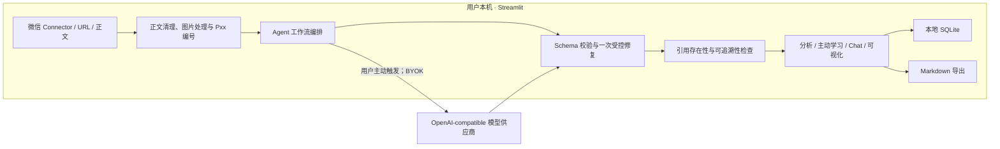

# 叠读 LayerRead — Portfolio Edition

LayerRead 是一个面向长文章的 Agentic 阅读项目。它把文章导入、结构化分析、引用验证、主动学习、文章 Chat 和 Markdown 导出组合成一条可追溯的阅读工作流。

> **[Live Demo：立即在线体验](https://layerread-agentic-reader-demo.streamlit.app/)**
>
> 在线 Demo 使用维护者托管的模型和会话级临时数据；本仓库是本地 BYOK 版本，使用你的模型账号并把文章保存在你的电脑上。

这是公开的 Portfolio Edition：使用基础 Prompt，并由用户在本机 `.env` 中配置自己的模型 API Key（BYOK）。公开版包含本地 Chrome Connector、图片导入和 BYOK 视觉模型调用；生产 Prompt 与 Notion 集成不在公开功能范围内。

Copyright © 2026 Dchaoqun。本仓库以 **GNU Affero General Public License v3.0 only（AGPL-3.0-only）** 发布。允许个人和商业使用、修改与再分发；分发本项目或使用修改版提供网络服务时，必须按照许可证向相应用户提供完整对应源码。详见 [LICENSE](./LICENSE)。本软件不提供任何明示或默示担保。

## 架构



文章、图片和凭据不会进入 LayerRead 开发者的数据库。模型调用只在用户明确触发时发生；是否发送图片由用户单独授权。

## 功能

- Chrome Connector、URL 导入与正文粘贴
- 正文图片筛选、高清处理与长图分片
- 结构化文章分析与阅读决策
- `[Pxx]` 引用规范化、存在性检查和人工核验视图
- 主动回忆、Teach-back、应用题与学习反馈
- 围绕当前文章的连续 Chat 和对话总结
- Markdown 导出
- 本地 SQLite 自动保存与历史文章恢复

## 本地启动

```powershell
git clone https://github.com/Dchaoqun/layerread-agentic-reader.git
Set-Location layerread-agentic-reader
uv sync
Copy-Item .env.example .env
notepad .env
uv run streamlit run app.py
```

在启动应用前，打开本机 `.env` 并填写：

- `LLM_API_KEY`：你自己的 API Key
- `LLM_BASE_URL`：OpenAI-compatible API 地址
- `LLM_MODEL`：准确的模型名称
- `LLM_SUPPORTS_VISION`：仅在模型支持图片输入且允许发送文章图片时设为 `true`

`.env` 仅保存在用户电脑上并已被 Git 忽略；应用只在本机进程中读取配置，不会在网页显示 API Key，也不会把它写入 SQLite、Markdown 或普通日志。Connector 重新打开 `localhost` 或 Streamlit 建立新会话时，模型配置仍会从 `.env` 恢复。不要提交、截图或分享真实 `.env`。

## 安装 Chrome Connector

1. 先启动本地 LayerRead，默认地址为 `http://localhost:8501/`。
2. 在 Chrome 打开 `chrome://extensions/` 并开启“开发者模式”。
3. 点击“加载已解压的扩展程序”。
4. 选择仓库中的 `browser_extension/layerread_connector`。
5. 打开微信公众号文章，等待页面加载完成并从顶部滚动到底部，确认正文图片均已显示。
6. 点击 LayerRead Connector 图标；接收后对照原文核对图片，再确认文章。

Connector 使用窄范围权限读取用户已经打开的微信文章，并通过一次性令牌把正文和重要图片交给本机 LayerRead。临时传输数据十分钟后失效；LayerRead 完成校验并确认接收后立即从浏览器会话存储删除，传输中断时可以安全重试。

微信公众号图片可能懒加载；尚未滚动到、尚未显示的图片无法被 Connector 读取。发现图片缺失时，应刷新原文、完成从顶部到底部的滚动后重新导入，不要直接确认不完整的文章。

### 图片发送与模型费用

- Connector 导入图片时不会立刻调用模型。
- 只有用户在本机 `.env` 中明确设置 `LLM_SUPPORTS_VISION=true`，随后主动点击分析，图片才会发送给用户配置的模型供应商。
- 图片请求可能产生额外 Token 或多模态模型费用，费用由用户自己的模型账号承担。
- 图片进入模型供应商后，适用该供应商的数据保留、隐私和合规政策；LayerRead 无法替用户改变这些规则。
- 如果没有启用视觉能力，图片仍可保存在本地文章中，但不会进入模型请求。

### 本地图片与 SQLite

- 处理后的图片会跟随文章保存在用户自己的 `data/layerread.sqlite3`，不会上传到 LayerRead 开发者的数据库。
- 图片以 Data URL 形式保存，可能显著增加 SQLite 文件体积；长图和图片较多的文章尤其明显。
- `data/` 和 `*.sqlite3` 已加入 Git 忽略规则，请勿把包含私人文章或图片的数据库提交到公开仓库。
- 敏感图片是否导入、保留和发送，由本地用户自行决定。

## 数据边界

- 默认数据库：`data/layerread.sqlite3`
- 文章、分析、学习记录和 Chat 保存在本地 SQLite
- API Key、Base URL 和模型名称从本机 `.env` 读取；`.env` 已被 Git 忽略
- 模型请求只在用户明确点击分析、出题、反馈、Chat 或对话总结时发出
- URL 导入会请求用户填写的网页地址
- Portfolio Edition 不提供 Notion 导出；在线 Demo 使用单独的精确域名 Connector 包，并保留图片与视觉分析能力

## 许可证

Portfolio Edition 的公开代码采用 `AGPL-3.0-only`。如果你修改本项目并通过网络向用户提供服务，需要在产品界面中向这些用户提供对应源码入口。独立商用授权不包含在本许可证中，如有需要请联系版权持有人。

提交反馈前请阅读 [CONTRIBUTING.md](./CONTRIBUTING.md)。安全问题请按 [SECURITY.md](./SECURITY.md) 私下报告，不要创建公开 Issue。直接依赖的许可证初查记录见 [THIRD_PARTY_NOTICES.md](./THIRD_PARTY_NOTICES.md)。在贡献者授权流程正式确定前，本项目暂不接受外部代码 Pull Request。
